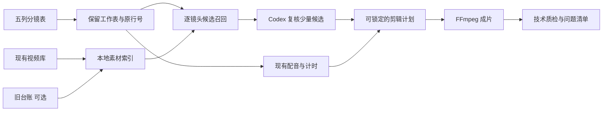

# AU&PR 表格成片与 Codex 订阅接入 Implementation Plan

> **For Hermes:** Use subagent-driven-development skill to implement this plan task-by-task.

**Goal:** 用户选择一份五列分镜 Excel 和一个现有素材库后，AU&PR 自动完成选片、配音、音画对齐、渲染，输出可播放的成片；Codex 使用用户自己的 ChatGPT 订阅辅助处理选片疑难和自然语言修改。

**Architecture:** 保留现有 Python Web 工作台、TTS 引擎和 FFmpeg 渲染器，在其前面增加“分镜导入 → 素材目录索引 → 候选召回 → 剪辑计划”四层。Codex 通过本机进程参与候选复核，返回受约束的计划建议；AU&PR 校验建议并执行渲染。每次任务以冻结的剪辑计划为重试和追溯依据。

**Tech Stack:** Python 3.11、标准库 XLSX 解析、SQLite、FFprobe/FFmpeg、现有 Web UI；Codex app-server 的本机 stdio 通道与 ChatGPT 订阅授权。无需 OpenAI API Key；订阅推理底层仍使用官方授权的模型请求。

---

## 1. 已确认的产品输入与代码基线

- 研发起点：独立工作树 `D:\GitHub\By\AU&PR\AU-PR-v071-20260815`，分支 `codex/v071-20260815`，提交 `1ef5bc0`。原始 `AU-PR` 工作树保留，不在本蓝图执行期间重置或覆盖。
- 实际导入样本：`D:\桌面\2026-09-09\2026-09-09` 下 145 份 `.xlsx`，每份是一部作品，合计 1,849 行，每部 9–30 镜头。145 份表头一致：A 镜头序号、B 口播文稿、C 时长、D 图片生成提示词、E 视频生成提示词；只有一个工作表，名称有三种。
- 素材根：`D:\宇宙素材`。2026-10-07 只读盘点发现 15,636 个带 `BJ...` 编号的视频文件。目录仍可能由另一项整理工作更新，索引必须增量刷新，不能依赖某一瞬间的目录层级。
- `D:\桌面\协同作战标.xlsx` 是**旧素材说明来源**：9,071 个 M 列视频编号中，9,046 个在当时的素材库中能找到。新导入的 1,849 条口播与旧台账 E 列去空白后全文精确匹配数为 0。M 可标注旧素材，不是新表行号或直接选片规则。
- 现有 `xlsx_reader.read_column` 只读首表的单列、丢弃原 Excel 行号；`material_select` 只支持平铺/文件夹顺序/文件夹名关键词；`render_b` 对每行取一个源视频并从片头处理，尚不能按剪辑计划指定源片入点。
- 现有配音、计时、逐段渲染、字幕、剪映/Premiere 导出应复用。Codex 订阅只覆盖符合资格的 Codex 模型请求，不覆盖现有 dots/Fish/Edge 配音及 GPU 成本。

## 2. 用户流程与完成定义

主入口名为“表格成片”：选择单份 Excel、素材库、配音方案、输出目录，点击“生成成片”。软件读取五列、识别镜头，后台索引素材，先检索文本描述与已有标签，再用候选关键帧核对画面和运动；随后生成或复用配音，按**实际音频时长**确定画面截取和速度，渲染 MP4。页面显示逐步进度、每句的来源素材与选用理由，并在完成时展示成片、剪辑计划和问题清单。

默认任务以产出 MP4 为目标。低置信度镜头采用当前最优可播放候选并在问题清单中标明，用户可以单句替换后局部重渲染；没有任何可播放候选、配音失败或渲染失败时才以明确原因结束任务。不得用随机文件夹顺序悄悄充当语义匹配。

### 数据流



## 3. 模块边界与数据契约

1. **分镜导入。** 新增结构化 `StoryboardRow`，保留 `sheet_name`、`excel_row`、A–E 原文、`duration_hint_seconds`。按表头定位列，兼容中文数字/数字镜头号、`7秒` 等时长；空白行跳过但不压缩原行号。校验重复镜头号、无口播、时长无效，UI 显示可修复错误。原有 `read_column` 继续供旧入口使用。
2. **素材目录。** SQLite 存 `asset_id`、真实路径、视频编号、目录标签、时长、画幅、帧率、文件大小/修改时间、可用状态、描述来源、关键帧缓存路径。首次扫描可中断和续跑；原视频只读。旧台账按 M 编号给可找到的视频补 E/G/H 描述；无台账记录的视频仍由文件名、文件夹名和后续视觉标签参与检索。索引变更时只更新受影响文件。
3. **候选召回。** 用 B 口播、D 静态画面、E 运动要求分别评分；中文字符 n-gram/同义词与素材描述、目录标签做本地粗筛，排除损坏、明显错误类别和不合画幅素材。给每行输出有证据的 Top-N 候选。避免把 1.5 万条视频或完整视频发给 Codex。
4. **Codex 复核。** 只在候选接近、描述缺失、视觉/运动冲突或用户提出修改时调用。向 Codex 提供该行 B/C/D/E、少量候选的元数据与抽帧；要求返回 `selected_asset_id`、理由、疑点和是否需要复核。App Server 支持本地图片输入与逐次 `outputSchema`，但具体模型能力、额度和实际效果必须通过本机原型验证。AU&PR 只接受候选集合内的 ID，并检查文件存在、时长/画幅和结构化输出。
5. **剪辑计划。** 每部作品独立写 `edit_plan.json`，记录工作表副本/哈希、原始行号、素材库索引版本、模型建议版本、每行 `asset_id`、源路径、入/出点、速度/补帧策略、实际配音时长、置信等级、证据和人工锁定状态。重渲染优先复用已锁定结果；Excel 或素材文件变化时对受影响行重新核验，不仅比较行数。
6. **成片。** 扩展逐段渲染接口以接收入/出点和对齐策略，保持现有音轨混合、字幕、画幅、剪映/Premiere 导出。输出 `成片.mp4`、剪辑计划、选片报告、技术质检 JSON；完成状态以产物存在且 FFprobe 可读、帧/音频时长合格为准。

## 4. Codex 订阅接入边界

- 先做本机小原型：检测 Codex 可执行程序、完成 ChatGPT 订阅授权、经 stdio 初始化 app-server、输入一条文本和少量本地候选图片、获得符合 schema 的建议、处理登录失效和用量受限。验证成功后才将其放进主成片任务。
- 正式方案使用“Continue with ChatGPT”授权与 App Server 的 OAuth token provider；本机凭据按官方要求安全保存、刷新。界面显示连接状态、运行/失败/中断、工具事件及产物；每部作品保存自己的对话线程。模型列表不能当作账号有权使用的证明，需以真实成功调用确认。
- Codex 只看分镜文本和候选抽帧。此订阅通道支持图片，不支持直接视频/音频输入；视频解码、候选生成和渲染由 AU&PR 本地执行。模型建议必须经过程序校验；不授予其自由移动/删除素材或修改源表的权限。
- **发布闸门：** 官方文档当前覆盖开源及本地个人项目的订阅用量；付费或远程托管发行需另行确认参与资格。AU&PR 现有许可证入口意味着未来可能发行，在资格未确认前，只把订阅集成作为个人本机原型，不把它承诺为公开收费版功能。

官方依据：

- [Sign in with ChatGPT 订阅用量范围](https://developers.openai.com/siwc/token-sharing-open-source)
- [Codex App Server 订阅授权配置](https://developers.openai.com/siwc/token-sharing-open-source/codex-app-server)
- [订阅通道支持与限制](https://developers.openai.com/siwc/token-sharing-open-source/preview-limitations)
- [App Server 本机协议、图片输入和结构化输出](https://learn.chatgpt.com/docs/app-server)

## 5. 迭代阶段与验收门槛

| 阶段 | 交付 | 进入下一阶段的证据 |
|---|---|---|
| 0.8-A 输入与索引 | 五列表格解析、素材库可恢复索引、旧台账可选导入 | 145 份样本全部可读且镜头数/原始行号正确；素材目录扫描后原文件路径与数量不受程序操作影响 |
| 0.8-B 自动选片 | 本地候选召回、来源证据、剪辑计划版本化 | 三份试片的每行均有候选或明确缺片原因；改表/移走素材后计划不会错误复用 |
| 0.8-C 直接成片 | 主界面“选表+选库+生成”、音频对齐、入点剪切、MP4 与报告 | 三份试片一键得到可播放 MP4；行数、字幕、音频、画面段对应且 FFprobe 验证通过 |
| 0.9-A Codex 订阅原型 | 登录、图片候选复核、schema 输出、错误恢复 | 当前订阅账号完成一次真实选片调用；限额/断网/退出登录时仍可完成本地流程或明确报告 |
| 0.9-B 协作剪辑 | 疑难镜头建议、自然语言修改单句、锁定/撤销、运行记录 | 单句修改只影响该句及必要下游产物；推荐来源和人工决定可追溯 |
| 1.0 批量与发布 | 多表排队、缓存复用、质量评估、打包验证 | 145 份表可批量预检；试片质量评审通过；目标机器从安装到成片完成实测；订阅发行资格已核定 |

试片建议固定为“时间旅行”（12 镜头）、“星系红移”（14 镜头）、“一毫米黑洞”（13 镜头），覆盖中文数字序号、数值序号和不同运动描述。先给 39 个镜头建立人工“可用/不可用”标注，再确定自动选片的质量阈值；技术成片成功与语义选片质量分开验收。

## 6. 首批实施任务与预计文件

以下任务按顺序执行，每项先写针对真实表格结构的失败测试，再做最小实现并运行对应测试；阶段末再跑组合回归。实施前先记录目标分支现有测试状态，避免把历史失败误算为本次回归。

1. **定义五列表格模型与解析器。** 扩展 `source/dub_align_studio/xlsx_reader.py` 或新增 `storyboard_reader.py`；新增 `tests/test_dub_align_storyboard.py`。覆盖三种工作表名、A 列中文/数字序号、C 列秒数、空行和原行号。
2. **建立只读素材索引。** 新增 `source/dub_align_studio/material_catalog.py`、`tests/test_dub_align_catalog.py`；用临时小目录验证扫描、重扫、重命名检测、重复编号及台账描述绑定，不在真实 `D:\宇宙素材` 上写测试数据。
3. **实现候选召回。** 新增 `source/dub_align_studio/material_retrieval.py`、`tests/test_dub_align_retrieval.py`；测试 B/D/E 权重、无文本描述、科学题材排除、时长约束及确定性排序。
4. **冻结剪辑计划。** 新增 `source/dub_align_studio/edit_plan.py`、`tests/test_dub_align_edit_plan.py`；测试输入哈希/素材变更、人工锁定、合法来源路径、JSON 回读和只重算受影响行。
5. **打通渲染。** 修改 `source/dub_align_studio/render_b.py`、`studio_pipeline.py`；扩展 `tests/test_dub_align_b.py`、`tests/test_dub_align_pipeline.py`，验证源片入点、短片补足、音轨和画面总长。
6. **接入主界面和任务队列。** 修改 `source/dub_align_studio/web_server.py`、`source/dub_align_studio/web/index.html`；扩展 `tests/test_dub_align_web.py`。沿用现有任务状态和生成队列，不另建并行任务框架。
7. **验证并接入 Codex。** 新增 `source/dub_align_studio/codex_bridge.py` 与对应协议/错误测试；先用假 app-server 测消息与状态，再用用户订阅做一次真实、小规模的连接验证。选片服务只接收合规结构化建议。
8. **质量评估和打包。** 用三份试片核对 MP4/音频/字幕/镜头对应；对 39 行作人工语义评分；再按 `打包说明.md` 验证轻量版和目标电脑路径，不把素材库或登录凭据打进安装包。

建议运行命令（PowerShell，工作目录为该独立工作树）：

```powershell
$env:PYTHONPATH='source'
& 'D:\Python\Python311\python.exe' -m unittest discover -s tests -p 'test_dub_align_storyboard.py'
& 'D:\Python\Python311\python.exe' -m unittest discover -s tests -p 'test_dub_align_material.py'
& 'D:\Python\Python311\python.exe' -m unittest discover -s tests -p 'test_dub_align_b.py'
& 'D:\Python\Python311\python.exe' -m unittest discover -s tests -p 'test_dub_align_web.py'
```

## 7. 风险与待决事项

- **语义质量：** 新表与旧台账没有口播全文精确对应，必须用检索与视觉复核。首次成片可自动完成，但“可播放”不等于“每镜头都贴切”；以 39 镜头人工评分校准召回规则和 Codex 用量。
- **素材库动态更新：** 另一个整理任务可能改变文件名/目录。以稳定视频编号、路径快照和文件指纹核验；每次运行先检查受影响项。
- **订阅限额及资格：** 订阅请求是否可用、具体模型是否支持图片，靠实际成功调用确认；额度不足时返回清楚的降级状态。若决定付费发行，需先完成官方资格路径。
- **素材与画幅：** 宇宙分镜表常写 16:9，UI 默认仍是 9:16；导入时从表格提示词/项目配置推断建议画幅并显示，最终以用户选定的画幅渲染。
- **需要用户最终确定的产品口径：** 试片默认用现有哪种配音方案；未来 AU&PR 是个人工具、开源软件还是收费发行。蓝图默认对低置信度镜头先自动出片并在问题清单中标红，上述待定项不阻碍 0.8-A/0.8-B 的实现。

本蓝图仅规划；未修改软件代码、素材或源表。
