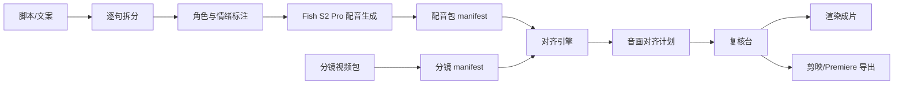

# AU&PR 架构设计

## 产品定位

AU&PR 不是单纯的 TTS 工具，也不是单纯的剪辑工具。它更适合定义为“配音生成 + 音频主轴分镜对齐”的生产工作台。

目标用户先把剧本或解说稿整理成逐句脚本，再用 Fish Audio S2 Pro 生成逐句配音包，最后让系统把配音包和分镜视频对齐成可预览、可导出、可二次精修的成片。

## 核心工作流



## 分层结构

### 1. 项目层

负责项目目录、配置、素材索引和产物管理。

建议目录：

```text
project/
  project.yaml
  script/
    script_lines.jsonl
    speaker_cast.json
  voice/
    references/
    generated/
    audio_manifest.json
    audio_manifest.csv
  shots/
    source/
    shot_manifest.json
    shot_manifest.csv
  align/
    alignment_plan.json
    alignment_plan.csv
  renders/
    final.mp4
    render_manifest.json
  exports/
    capcut/
    premiere/
```

### 2. 脚本层

职责：

- 把文本拆成稳定的 `line_id`。
- 给每句绑定角色、音色、语气、情绪标签、停顿提示。
- 保留原文、清洗文本和 TTS 文本，方便回滚。

推荐数据：

```json
{
  "line_id": "L0001",
  "scene_id": "S001",
  "speaker": "narrator",
  "text": "她终于发现，所谓重生不是奖励，而是第二次审判。",
  "tts_text": "[low voice] 她终于发现，所谓重生不是奖励，而是第二次审判。",
  "emotion": "低沉悬疑",
  "target_seconds": null
}
```

### 3. Fish S2 Pro 适配层

职责：

- 不直接耦合 Fish Speech 源码，把它封装成 `TTSProvider`。
- 支持两种运行模式：本地服务接口优先，命令行推理兜底。
- 将每句输出标准化为音频文件、时长、speaker、生成参数和状态。

接口草案：

```python
class TTSProvider:
    def synthesize_line(self, line, voice_profile, output_path):
        ...

    def synthesize_batch(self, lines, voice_profiles, output_dir):
        ...
```

输出清单：

```json
{
  "line_id": "L0001",
  "index": 1,
  "speaker": "narrator",
  "audio_file": "001_L0001.wav",
  "duration_seconds": 3.42,
  "engine": "fish-s2-pro",
  "voice_ref": "voice_ref/narrator.wav",
  "prompt_tags": ["low voice"],
  "status": "ok"
}
```

### 4. 分镜包层

职责：

- 导入分镜片段并生成 `shot_id`。
- 用 FFprobe 读取时长、分辨率、帧率、是否含音轨。
- 支持顺序配对，也为后续语义匹配预留字段。

推荐字段：

```json
{
  "shot_id": "S001_SH001",
  "index": 1,
  "video_file": "001.mp4",
  "duration_seconds": 5.0,
  "width": 1080,
  "height": 1920,
  "tags": ["反转", "近景"],
  "usable": true
}
```

### 5. 对齐引擎

第一版沿用水星剪辑验证过的保守策略：

- 音频与分镜按自然顺序配对。
- 三者数量不一致时按最短列表对齐，多余项写入未匹配清单。
- 每句最终画面时长等于配音时长。
- 视频长于音频：裁头、裁中或裁尾。
- 视频略短于音频：慢放。
- 视频明显短于音频：末帧定格。

后续增强：

- 文本语义和分镜标签辅助配对。
- 语音停顿点驱动镜头切换。
- 音频能量峰值驱动字幕强调和转场。
- 允许手工锁定某些句子与镜头，其他部分自动重排。

### 6. 渲染引擎

职责：

- 根据对齐计划生成逐段视频。
- 每段映射 `0:v:0` + `1:a:0`，音频替换原片音轨。
- 支持画幅模板：9:16、16:9、1:1、4:3、3:4。
- 支持字幕烧录、水印、顶部提示文字、BGM 避让。
- 拼接输出整片，并写入 `render_manifest.json`。

### 7. 复核台

核心视图：

- 左侧：逐句台词列表，显示角色、情绪、生成状态。
- 中间：波形 + 分镜预览 + 当前对齐策略。
- 右侧：单句重配、替换镜头、调整裁剪锚点、字幕开关、BGM 设置。
- 底部：异常队列，集中展示时长偏差、缺失音频、缺失分镜、失败渲染。

## MVP 边界

第一版只做这些：

- 导入脚本并按行生成配音。
- 生成 `audio_manifest.json/csv`。
- 导入分镜视频并生成 `shot_manifest.json/csv`。
- 按顺序对齐并生成 `alignment_plan.json/csv`。
- FFmpeg 合成 MP4。
- 允许单句重新生成配音后局部重算。

暂不做：

- 完整 NLE 时间线编辑器。
- 自动找片段。
- 自动生成分镜视频。
- 内置第三方模型权重下载。
- 多账号矩阵分发。

## 技术建议

研究阶段建议采用：

- Python core：便于复用 FFmpeg、FFprobe、Fish Speech 适配和单元测试。
- FastAPI worker：TTS 生成与渲染都是长任务，适合异步队列。
- SQLite：记录项目、任务、素材、manifest 和渲染状态。
- Web UI 或 Tauri UI：比传统 Tk 更适合波形、预览和时间线复核。
- FFmpeg：继续作为第一版渲染核心。

包结构草案：

```text
src/aupr/
  core/
    project.py
    manifest.py
    duration.py
  tts/
    provider.py
    fish_s2.py
    mock.py
  shots/
    ingest.py
    probe.py
  align/
    planner.py
    strategies.py
  render/
    ffmpeg.py
    subtitles.py
    bgm.py
  export/
    capcut.py
    premiere.py
```

